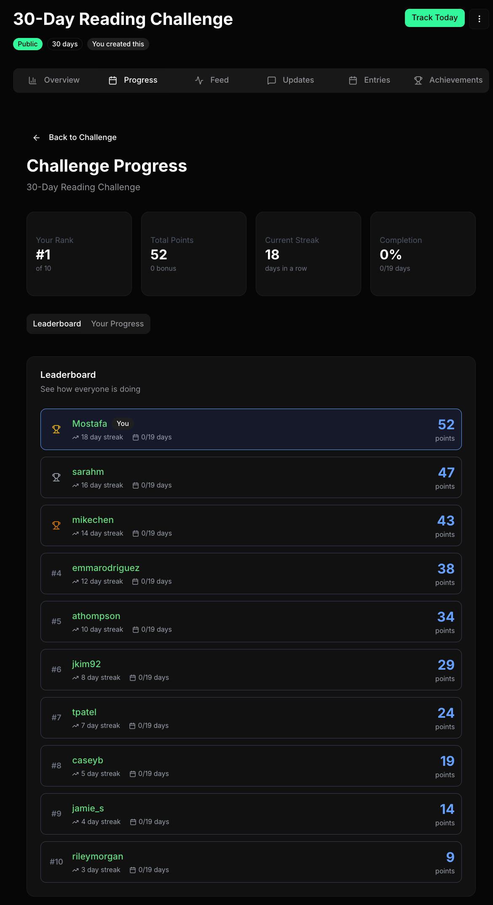

# Gritful

[](https://opensource.org/licenses/MIT)
[](https://www.gritful.app)
[](https://nextjs.org/)
[](https://www.typescriptlang.org/)

**Multiplayer habit tracking.**

Gritful turns personal goals into competitive challenges. Track anything—workouts, reading, meditation, learning—and compete with friends through points, achievements, and leaderboards. While most habit apps are solo tools where motivation fades, Gritful builds accountability into the experience. Flexible scoring rewards progress over perfection, so you're competing to improve, not to be perfect.



**[Live Demo](https://www.gritful.app)**

---

## Highlights

- **Flexible task system** — Daily, weekly, monthly, or one-time tasks
- **Points-based scoring** — Binary, scaled, or tiered modes to reward progress
- **Achievements** — 14 unlockable badges across streak, points, and consistency categories
- **Activity feed** — See what your friends are accomplishing with reactions
- **Leaderboards** — Compete with participants in real-time
- **Challenge templates** — 8 pre-built templates for quick setup
- **Public profiles** — Share your stats and challenge history
- **Email notifications** — Stay updated on challenge activity
- **Dark/light mode** — Full theme support

---

## Features

### Challenges

- Create public challenges anyone can join or private challenges with invite codes
- Set challenge duration or create ongoing challenges with no end date
- Configure grace periods for flexibility after challenges end
- Use templates or build custom challenges from scratch

### Task Tracking

- Six task types: boolean, number, duration, choice, text, and file upload
- Configurable validation (min/max values, required fields)
- Calendar view showing completion status
- Photo uploads with automatic optimization

### Scoring & Gamification

- **Binary scoring** — Full points if threshold met
- **Scaled scoring** — Proportional points based on progress
- **Tiered scoring** — Different point values for achievement levels
- Streak bonuses and perfect day rewards
- Achievement system with automatic unlock notifications

### Social

- Browse and join public challenges
- Activity feed with reactions
- Public profiles with aggregate stats
- Participant leaderboards with points and streaks

---

## Quick Start

### Prerequisites

- Node.js 20+
- A [Supabase](https://supabase.com) account

### Installation

```bash
# Clone the repository
git clone https://github.com/Miandari/gritful.git
cd gritful

# Install dependencies
npm install

# Set up environment variables
cp .env.local.example .env.local
# Edit .env.local with your Supabase credentials

# Run the development server
npm run dev
```

Open [http://localhost:3000](http://localhost:3000) in your browser.

### Environment Variables

```env
NEXT_PUBLIC_SUPABASE_URL=https://your-project.supabase.co
NEXT_PUBLIC_SUPABASE_ANON_KEY=your-anon-key
SUPABASE_SERVICE_ROLE_KEY=your-service-role-key
NEXT_PUBLIC_APP_URL=http://localhost:3000
```

---

## Tech Stack

| Category | Technology |
|----------|------------|
| Framework | Next.js 16 (App Router) |
| Language | TypeScript |
| Database | Supabase (PostgreSQL) |
| Auth | Supabase Auth |
| Storage | Supabase Storage |
| Styling | Tailwind CSS v4 + shadcn/ui |
| State | Zustand + TanStack Query |
| Forms | React Hook Form + Zod |

---

## Project Structure

```
gritful/
├── app/
│   ├── (auth)/                 # Login, signup pages
│   ├── dashboard/              # Dashboard, today, my challenges
│   ├── challenges/
│   │   ├── [id]/
│   │   │   └── (tabs)/         # Challenge tabs (entries, progress, achievements, feed, updates)
│   │   ├── browse/             # Public challenge discovery
│   │   └── create/             # Challenge creation wizard
│   ├── profile/[username]/     # Public profiles
│   └── actions/                # Server actions
├── components/
│   ├── ui/                     # shadcn/ui components
│   ├── challenges/             # Challenge-related components
│   └── progress/               # Progress tracking components
├── lib/
│   ├── supabase/               # Supabase client config
│   ├── stores/                 # Zustand stores
│   ├── templates/              # Challenge templates
│   └── utils/                  # Utility functions (scoring, etc.)
└── supabase/
    ├── migrations/             # Database migrations
    └── functions/              # Edge functions
```

---

## Scripts

```bash
npm run dev          # Start development server
npm run build        # Build for production
npm run start        # Start production server
npm run lint         # Run ESLint
npm run type-check   # TypeScript type checking
npm run format       # Format with Prettier
```

---

## Contributing

Contributions are welcome! Please feel free to submit a Pull Request.

1. Fork the repository
2. Create your feature branch (`git checkout -b feature/amazing-feature`)
3. Commit your changes (`git commit -m 'Add amazing feature'`)
4. Push to the branch (`git push origin feature/amazing-feature`)
5. Open a Pull Request

---

## License

This project is open source and available under the [MIT License](LICENSE).

---

## Acknowledgments

- [Next.js](https://nextjs.org/) — React framework
- [Supabase](https://supabase.com/) — Backend platform
- [shadcn/ui](https://ui.shadcn.com/) — UI components
- [Tailwind CSS](https://tailwindcss.com/) — Styling

---

**[Try Gritful](https://www.gritful.app)** — Build habits together.
